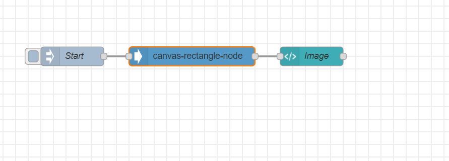

# Draw canvas rectancles on image with Node-RED

The purpose of this node is to draw in easy way some rectangles on an image to highlight some particular objects.

This node is useful inside object detection flows, where we can use node (like tensorflow node) to detect object inside images and then this node is able to transform the tensorflow output to rectancles using canvas


[Node-RED](https://nodered.org) is an open source visual programming tool that offers a browser-based flow editor for wiring together devices, APIs, and services. Built on Node.js, you can extend its features by creating your own nodes or taking advantage of the JavaScript and NPM ecosystem.

[Canvas API](https://developer.mozilla.org/en-US/docs/Web/API/Canvas_API) provides a means for drawing graphics via JavaScript and the canvas element.

## Prerequisites

- [git](https://git-scm.com/downloads) installed and configured
- [Node.js](https://nodejs.org/en/) installation (with NPM)
- Familiarity with basic [Node-RED](https://nodered.org/docs/) concepts

## Steps

Follow these steps to setup and run this code pattern. The steps are described in detail below.

1. [Clone the repo](#1-clone-the-repo)
1. [Install dependencies](#2-install-dependencies)
1. [Import the Node-RED flow](#3-import-the-node-red-flow)
1. [Deploy the Node-RED flow](#4-deploy-the-node-red-flow)

### 1. Clone the repo

First let's get the code. From the terminal of the system you plan on running Node-RED from,
do the following:

1. Clone the `canvas-rectangle-node` repo:
    ```
    $ git clone https://github.com/caprasilana/canvas-rectangle-node.git
    ```

1. Move into the directory of the cloned repo:
    ```
    $ cd canvas-rectangle-node
    ```

### 2. Install dependencies

You can install the necessary dependencies by running:

```
$ npm install
```

If you already have Node-RED installed on your system, you can just install
the dependencies from your Node-RED user directory (`~/.node-red`). Run the following block of code, being
sure to change the `<full path>` placeholder to the path of the cloned repo:

```
cd ~/.node-red
npm install <full path>/canvas-rectangle-node
```

Be sure to restart Node-RED if it was already running when installing this way.

### 3. Import the Node-RED flow

Once installed the node can be added and used in the flow of your Node-RED application. To import the flow available in this repo:

1. Make sure Node-RED is running
1. Open a browser and go to your Node-RED Editor
1. Click on the Node-RED Menu
1. Click on **Import**
1. Select the **Clipboard** tab
1. Click on **select a file to import**
1. Browse to and select `canvas-rectangle-node.json` flow file in the cloned repo
1. Select **Import to new flow**
1. Click **Import**

To execute the flow node-red-dashboard is required in your palette
### 4. Deploy the Node-RED flow

From the Node-RED editor, do the following:

1. Click the **Deploy** button.
1. Click the `file inject` node to process the image.  


The image will be processed by the `canvas-rectangle-node` node and the output will be displayed in the **Dashboard** panel.

## Output

#### flow




